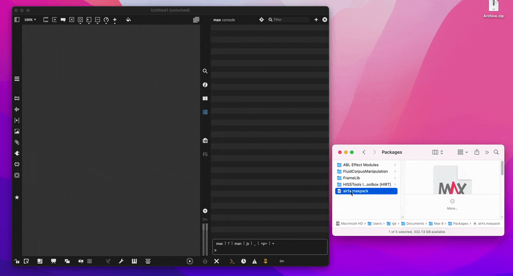

# airfx

Max objects ported from the open source VST2 [airwindows](https://github.com/airwindows/airwindows/) plugins by Chris Johnson. 

# Installing

Packages built for macOS and Windows are available on the [GitHub Releases page](https://github.com/isabelgk/airfx/releases/) as `airfx.maxpack`. (Older versions are `package.zip`.)

> **`maxpack`?**  A maxpack file is a package Max knows how to install. (Under the hood, it's just a renamed `zip` archive.) The added benefit is that on macOS, it will automatically handle xattr quarantine removal so you do not need to click accept on the "External cannot be loaded due to macOS quarantine, Max can attempt to remove quarantine attributes" dialog for every new external loaded.

Download this file and choose one of the following options for install:
1. Drag and drop the `maxpack` file onto the Max **console** (not the patcher window).

   

2. Place the `maxpack` file in your Max packages directory (for example, `~/Documents/Max 9/Packages/`) and start Max.
3. Double-click the `maxpack` file.
4. Rename the file to have a `zip` extension (e.g. `airfx.zip` or `package.zip`) and unzip to your Max packages directory.

# License

This project and the Airwindows VSTs are licenced under the MIT license.
